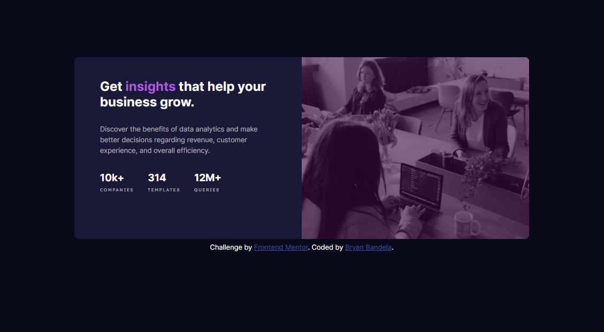

# Frontend Mentor - Stats preview card component solution

This is a solution to the [Stats preview card component challenge on Frontend Mentor](https://www.frontendmentor.io/challenges/stats-preview-card-component-8JqbgoU62). Frontend Mentor challenges help you improve your coding skills by building realistic projects. 

## Table of contents

- [Overview](#overview)
  - [The challenge](#the-challenge)
  - [Screenshot](#screenshot)
  - [Links](#links)
- [My process](#my-process)
  - [Built with](#built-with)
  - [What I learned](#what-i-learned)
  - [Continued development](#continued-development)
  - [Useful resources](#useful-resources)
- [Author](#author)

## Overview

### The challenge

Users should be able to:

- View the optimal layout depending on their device's screen size

### Screenshot



### Links

- Solution URL: [https://github.com/bryanbandela]

## My process

### Built with

- Semantic HTML5 markup
- CSS custom properties
- Flexbox
- Mobile-first workflow
-Sass for css development

### What I learned

I struggled with centering an element in the body. I came up with the following codes: 

```css
@media (min-width: 750px) {
  body {
    margin: 10% auto; }
}
```

### Continued development

I need to improve my skill on image as background.

### Useful resources
www.w3schools.com

## Author

- Website - [Bryan Bandela](https://github.com/bryanbandela)
- Frontend Mentor - [@bryanbandela](https://www.frontendmentor.io/profile/bryanbandela)


